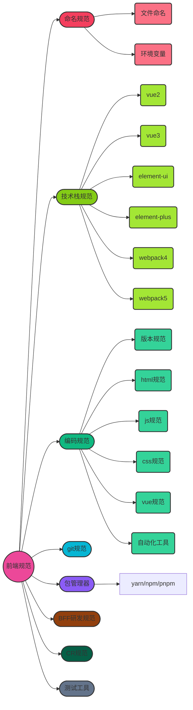

### 前端文档

#### 整体视图

```mermaid
graph LR
前端规范((前端规范))
style 前端规范 fill:#ec4899,stroke:#333,stroke-width:2px
mmgf([命名规范])
style mmgf fill:#f43f5e,stroke:#333,stroke-width:2px
技术栈规范([技术栈规范])
style 技术栈规范 fill:#84cc16,stroke:#333,stroke-width:2px
编码规范([编码规范])
style 编码规范 fill:#10b981,stroke:#333,stroke-width:2px
git规范([git规范])
style git规范 fill:#06b6d4,stroke:#333,stroke-width:2px
包管理器([包管理器])
style 包管理器 fill:#8b5cf6,stroke:#333,stroke-width:2px
BFF研发规范([BFF研发规范])
style BFF研发规范 fill:#92400e,stroke:#333,stroke-width:2px
CR规范([CR规范])
style CR规范 fill:#065f46,stroke:#333,stroke-width:2px
测试工具([测试工具])
style 测试工具 fill:#64748B,stroke:#333,stroke-width:2px

文件命名(文件命名)
style 文件命名 fill:#fb7185,stroke:#333,stroke-width:2px
环境变量(环境变量)
style 环境变量 fill:#fb7185,stroke:#333,stroke-width:2px

前端规范-->mmgf
mmgf-->文件命名
mmgf-->环境变量

vue2(vue2)
style vue2 fill:#a3e635,stroke:#333,stroke-width:2px
vue3(vue3)
style vue3 fill:#a3e635,stroke:#333,stroke-width:2px
element-ui(element-ui)
style element-ui fill:#a3e635,stroke:#333,stroke-width:2px
element-plus(element-plus)
style element-plus fill:#a3e635,stroke:#333,stroke-width:2px
webpack4(webpack4)
style webpack4 fill:#a3e635,stroke:#333,stroke-width:2px
webpack5(webpack5)
style webpack5 fill:#a3e635,stroke:#333,stroke-width:2px

前端规范-->技术栈规范
技术栈规范-->vue2
技术栈规范-->vue3
技术栈规范-->element-ui
技术栈规范-->element-plus
技术栈规范-->webpack4
技术栈规范-->webpack5

版本规范(版本规范)
style 版本规范 fill:#34d399,stroke:#333,stroke-width:2px
html规范(html规范)
style html规范 fill:#34d399,stroke:#333,stroke-width:2px
js规范(js规范)
style js规范 fill:#34d399,stroke:#333,stroke-width:2px
css规范(css规范)
style css规范 fill:#34d399,stroke:#333,stroke-width:2px
vue规范(vue规范)
style vue规范 fill:#34d399,stroke:#333,stroke-width:2px
自动化工具(自动化工具)
style 自动化工具 fill:#34d399,stroke:#333,stroke-width:2px

前端规范-->编码规范
编码规范-->版本规范
编码规范-->html规范
编码规范-->js规范
编码规范-->css规范
编码规范-->vue规范
编码规范-->自动化工具

前端规范-->git规范

前端规范-->包管理器-->yarn/npm/pnpm

前端规范-->BFF研发规范

前端规范-->CR规范

前端规范-->测试工具

```

