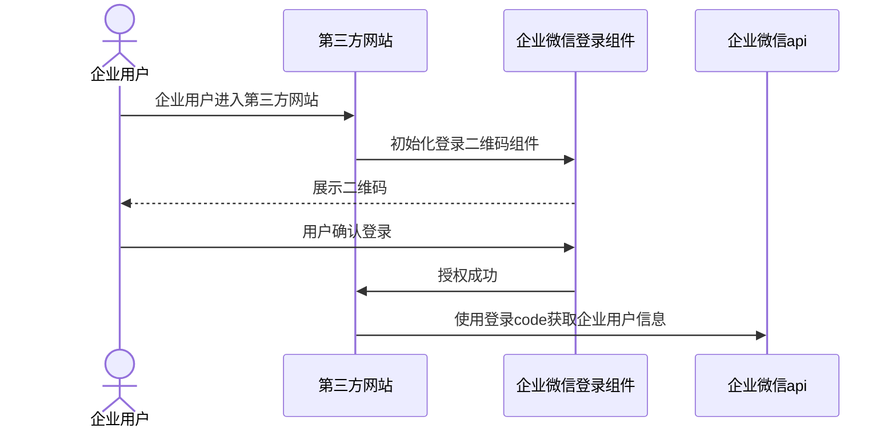

# saas企业微信扫码登录

## 扫码流程


步骤说明：

- 企业用户进入第三方网站
- 第三方网站引导用户进行企业微信登录
  - 内嵌企业微信登录组件[<font color=green>目前使用该方案</font>]
  - 新窗口打开登录页面
- 用户在企业微信确认并同意授权
  - 用户在登录授权页，确认并同意将自己的企业微信和登录账号信息授权给企业或服务商，完成授权流程。
- 授权后回调URI，得到授权码和过期时间
  - 授权流程完成后，会进入回调URI，并在URI参数中返回授权码，跳转地址 redirect_uri?code=xxx[<font color=orange>目前使用`@wecom/jssdk`不用跳转回调获取，使用监听方法即可</font>]
- 利用授权码调用企业微信的相关API
  - 在得到登录授权码code后，后端即可使用该授权码换取登录授权信息。

## `@wecom/jssdk` 使用
1. 安装
```bash
yarn add @wecom/jssdk
```
2. 使用
```js
// 引入
import * as ww from '@wecom/jssdk'
```

```js
// 初始化
const wwLogin = ww.createWWLoginPanel({
  el: '#ww_login',
  params: {
    login_type: 'CorpApp',
    appid: 'wwbbb6a7b539f2xxxxx',
    agentid: '10000xx',
    redirect_uri: 'https://work.weixin.qq.com',
    state: 'loginState',
    redirect_type: 'callback',
  },
  onCheckWeComLogin({ isWeComLogin }) {
    console.log(isWeComLogin)
  },
  onLoginSuccess({ code }) {
    // 登录成功后回调获取code,给后端调用获取企业微信用户信息
    console.log({ code })
  },
  onLoginFail(err) {
    console.log(err)
  },
})

// 卸载
wwLogin.unmount()
```
